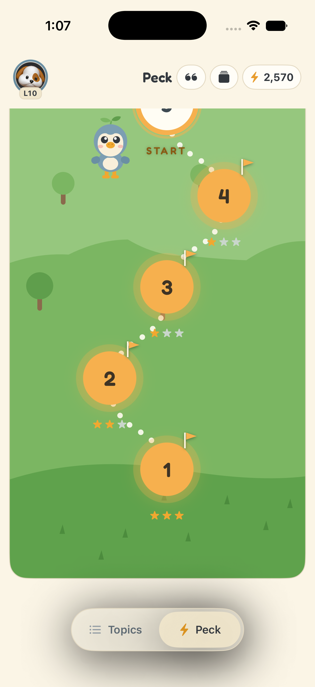
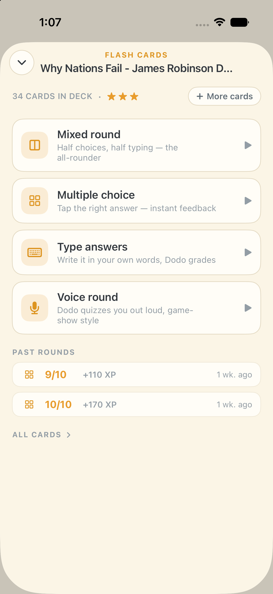
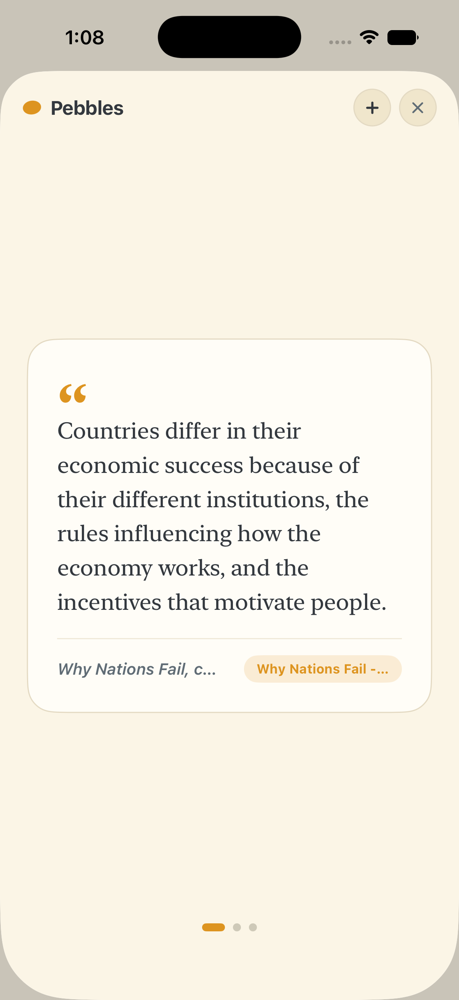

# Dodo 🦤

**An AI learning companion for things you actually want to remember.**

Feed Dodo a book, an article, a YouTube video, or your own notes. It becomes a topic you can chat with, get quizzed on, and — this is the part that matters — keep remembering, through spaced-repetition flash cards, voice quizzes, a daily card over iMessage, and mastery badges that dim unless you refresh them.

Dodo is a native iPhone app backed by a Next.js API. This repo is a periodically-updated snapshot of the working codebase, published so people can read it, learn from it, fork the app, or run their own backend.

| | | |
|---|---|---|
|  |  |  |

## Features

- **Topics from anything** — send a URL, paste text, or name a book; Dodo ingests it (including YouTube transcripts) and it becomes a chat-able topic with an AI tutor grounded in that material.
- **Flash cards with real scheduling** — decks generated per topic, played as multiple choice, typed answers (LLM-graded), mixed rounds, or out-loud voice rounds. SM-2 scheduling under the hood; thumbs-down buries a card, double-thumbs-up makes it a priority.
- **Peck** — a Duolingo-style level path across every deck you own.
- **Stars and mastery** — quizzes earn stars per topic; a final voice review earns a gold badge, and badges need a periodic 3-question refresher to stay gold.
- **Daily card over iMessage** — one card a day lands in Messages; your reply is graded and banked into the next Peck round.
- **Pebbles** — save quotes worth keeping; one resurfaces while a round is graded.
- **Voice** — talk to your tutor, take voice rounds, or do a walking review, over OpenAI Realtime.
- **Audio summaries** — a narrated summary of a topic, playable with the screen locked.

## Repo layout

```
ios/      SwiftUI iPhone app (XcodeGen project — the app is "Dodo",
          the internal identifiers keep the legacy name "Feynd")
web/      Next.js backend + web client (App Router, TypeScript)
          web/src/app/api/f2/   the HTTP API the iOS app talks to
          web/src/lib/f2/       all backend logic
          web/src/app/f2/       the web client
schema/   Numbered Supabase (Postgres) migrations — run in order
docs/     Screenshots and reference docs
```

One backend, two clients: the iPhone app and the web app hit the same `/api/f2/*` endpoints and share accounts.

## Running your own backend

You need: Node 20+, [pnpm](https://pnpm.io), a [Supabase](https://supabase.com) project (free tier is fine), and an [Anthropic API key](https://console.anthropic.com).

1. **Database** — create a Supabase project, then run every file in `schema/` in numeric order against it (Supabase Dashboard → SQL Editor, or `supabase db query`). They're idempotent.

2. **Environment** — `cd web && cp .env.example .env.local` and fill it in. Only three variables are required to boot: `SUPABASE_URL`, `SUPABASE_SERVICE_KEY`, `ANTHROPIC_API_KEY` (plus `F2_SESSION_SECRET`, any long random string). Everything else is optional and degrades gracefully — see the comments in `.env.example`.

3. **Run it**
   ```bash
   cd web
   pnpm install
   pnpm dev        # http://localhost:3000 — create an account on the signup page
   ```

4. **Deploy (optional)** — the web folder deploys to Vercel as-is. Set the env vars in the Vercel project. For the daily iMessage card, add a cron hitting `/api/f2/daily-card` (Vercel `vercel.json` crons work; the route checks `CRON_SECRET`).

## Running the iOS app

You need Xcode 16+ and [XcodeGen](https://github.com/yonaskolb/XcodeGen) (`brew install xcodegen`).

```bash
cd ios
cp Feynd/Secrets.swift.example Feynd/Secrets.swift   # point it at your backend (or localhost)
xcodegen generate
xcodebuild -project Feynd.xcodeproj -scheme Feynd \
  -destination 'platform=iOS Simulator,name=iPhone 17 Pro' build
```

Or open `Feynd.xcodeproj` in Xcode and run. To put it on a device, change the bundle identifier and signing team to your own.

Notes for forks:
- The Associated Domains entitlement (`ios/Feynd/Feynd.entitlements`) points at `feynd.cc` for universal links — change it to your domain or remove it.
- `./bump-build.sh` bumps the build number and regenerates the project.

## Voice (optional)

Voice rounds, the walking tutor, and audio summaries use the OpenAI Realtime and TTS APIs. Set `OPENAI_API_KEY`; the `OPENAI_REALTIME_*` variables tune model and voice. Without a key, voice features simply fail server-side and the rest of the app works.

## The iMessage daily card (optional, the fiddly one)

This is the one feature that needs hardware: a Mac that stays on, signed into Messages with an Apple ID that can send iMessages.

- **Inbound** (user replies) — [BlueBubbles server](https://bluebubbles.app) runs on that Mac and forwards incoming messages to your deployed `/api/f2/imessage/webhook` (set `BLUEBUBBLES_URL`, `BLUEBUBBLES_PASSWORD`, `BLUEBUBBLES_WEBHOOK_SECRET`).
- **Outbound** (sending cards) — by default goes through BlueBubbles too. On recent macOS versions BlueBubbles' AppleScript send path can hang; the backend prefers a tiny HTTP send agent when `F2_IMESSAGE_SEND_URL` / `F2_IMESSAGE_SEND_SECRET` are set (any endpoint that accepts `{chat_guid | handle, text}` and performs the send — ours is ~100 lines of AppleScript-over-HTTP).
- **Pairing** — users pair their handle from the app (Profile → iMessage); a 6-digit code round-trips over iMessage.
- **Scheduling** — a daily cron hits `/api/f2/daily-card` with `CRON_SECRET`.
- One gotcha worth knowing: if a user's handle belongs to the *same* Apple ID the sending Mac is signed into, use the per-user `daily_chat_guid` override (an email-alias-addressed chat) — see `schema/031`/`032` comments.

Skip all of this and the app is fully usable; the daily-card toggle just stays off.

## Contributing

Issues and PRs welcome. This repo is a snapshot mirror — the working tree lives elsewhere and gets synced here — so PRs may be applied upstream and land in the next snapshot rather than merging directly. Small, focused changes have the best odds.

## License

[MIT](LICENSE)
